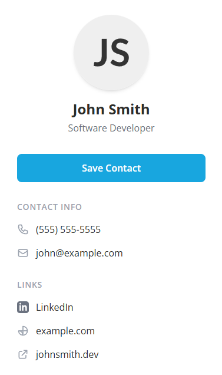

# Free Online Business Cards
 
A completely free, open-source digital business card template that eliminates the need for expensive monthly subscriptions or vendor lock-in. Many companies charge $20-30+ for digital business cards, often with recurring fees. This project provides a scalable, customizable solution using freely available technologies.

## 🎯 What is this?

This is a responsive, mobile-optimized digital business card that you can customize with your own information and deploy for free. When combined with NFC cards, it creates a seamless way to share your contact information - just tap your card to someone's phone and your contact details appear instantly.

**Why this exists**: Instead of paying monthly fees for digital business card services or custom contact page builders, this open-source solution gives you complete control over your digital presence without ongoing costs or vendor dependencies.

## 🔗 Live Demo

**[View Live Demo](https://example-digital-business-card.netlify.app/)**

## ✨ Features

- **Responsive Design**: Looks great on all devices
- **One-Click Contact Saving**: Visitors can save your contact info with just one click using the .vcf file generated by the page
- **NFC Compatible**: Perfect for NFC business cards
- **Fast Loading**: Optimized for quick access
- **Free to Deploy**: No hosting costs required
- **Easy to Customize**: Just edit the HTML file with your information
- **Professional Layout**: Clean, modern design that makes a great impression

## 🚀 Quick Start

### 1. Customize Your Information

Edit the `index.html` file and replace the placeholder information with your own:

- **Name**: Replace "John Smith" with your name
- **Title**: Replace "Software Developer" with your job title
- **Company**: Replace "Example Company" with your company name
- **Phone**: Replace "(555) 555-5555" with your phone number
- **Email**: Replace "john@example.com" with your email
- **LinkedIn**: Replace the LinkedIn URL with your profile
- **Website**: Replace "example.com" with your company website
- **Personal Website**: Replace "johnsmith.dev" with your personal site
- **Profile Image**: Replace the placeholder image URL with your photo

### 2. Add Your Profile Photo (Optional)

You can either:
- Replace the placeholder image URL in the `src` attribute with a link to your hosted photo
- Or add your photo file to the project folder as `image.jpg` and update the `src` to `"image.jpg"`

### 3. Add Your Logo (Optional)

If you want to use the loading screen with your logo:
1. Add your logo file as `logo.png` to the project folder
2. Uncomment the loader section in the HTML (lines 20-32)
3. Uncomment the loader JavaScript (lines 216-233)
4. Update the main content opacity from `opacity-100` to `opacity-0` (line 37)

## 🌐 Deploy for Free

Deploy your digital business card to any of these free hosting platforms:

- **Netlify**: Drag and drop your files or connect a GitHub repo at [netlify.com](https://netlify.com)
- **GitHub Pages**: Push to a GitHub repository and enable Pages in settings
- **Vercel**: Import your GitHub repository at [vercel.com](https://vercel.com)

**Example**: [https://example-digital-business-card.netlify.app/](https://example-digital-business-card.netlify.app/)

All platforms provide free hosting with HTTPS and give you a URL to use with your NFC cards.

⚠️ **Important**: Your deployed site must use HTTPS (not HTTP) for NFC cards to work properly on most smartphones.

## 📱 NFC Cards Setup

### Recommended NFC Cards

**[NFC Business Cards on Amazon](https://amzn.to/3IoM0yy)** *(affiliate link)*

Or look for NFC cards with these specifications:
- **Type**: NTAG213, NTAG215, or NTAG216 chips
- **Size**: Standard business card size (CR80)
- **Material**: PVC plastic cards work well
- **Memory**: 144+ bytes (sufficient for URLs)

### Programming Your NFC Cards

Use any NFC writing app to program your cards with your website URL:

**Recommended Apps**:
- **NFC Tools**: [iOS](https://apps.apple.com/app/nfc-tools/id1252962749) | [Android](https://play.google.com/store/apps/details?id=com.wakdev.wdnfc)
- **TagWriter**: [Android](https://play.google.com/store/apps/details?id=com.nxp.nfc.tagwriter)

**General Steps**:
1. Open your NFC app and select "Write" or "Program"
2. Choose "URL" or "Website" as the record type
3. Enter your deployed website URL
4. Hold your NFC card to your phone and tap "Write"
5. Test by tapping the card with any NFC-enabled phone

## 🎨 Customization Tips

### Colors
The template uses a professional color scheme:
- Background: `#2D2D2A` (dark gray)
- Accent: `#18A6DF` (blue)
- Text: Standard black and gray tones

You can customize these colors by editing the CSS classes in the HTML file.

### Adding More Information
You can easily add more contact methods or social links by:
1. Duplicating an existing link section
2. Updating the icon (use [Heroicons](https://heroicons.com) for consistency)
3. Adding the new information to the vCard data in the JavaScript section

### Fonts
The template uses 'Open Sans' from Google Fonts. You can change this by:
1. Updating the Google Fonts link in the `<head>` section
2. Changing the font-family in the CSS

## 🔧 Technical Details

- **Framework**: Pure HTML, CSS, and JavaScript (no dependencies)
- **Styling**: Tailwind CSS via CDN
- **Icons**: Heroicons SVG icons
- **Compatibility**: All modern browsers and mobile devices
- **Performance**: Optimized for fast loading on mobile networks

## 📝 License

This project is open source and available under the [MIT License](LICENSE).

## 🤝 Contributing

Contributions are welcome! Feel free to:
- Report bugs
- Suggest new features
- Submit pull requests
- Improve documentation

## 💡 Tips for Success

1. **Keep it simple**: Don't add too much information - focus on the essentials
2. **Test thoroughly**: Check your card on different devices and browsers
3. **Use high-quality images**: Your profile photo should be clear and professional
4. **Update regularly**: Keep your contact information current
5. **Monitor analytics**: Use Netlify or Google Analytics to see how often your card is accessed

## 🆘 Support

If you run into issues:
1. Check that your NFC cards are compatible with smartphones
2. Ensure your website URL is correct and accessible
3. Test your NFC programming with multiple devices
4. Verify your deployed site works on both desktop and mobile

## 🆘 Troubleshooting

### NFC Card Not Working
- **Check phone compatibility**: Ensure the phone has NFC enabled in settings
- **Card positioning**: Hold the card to the back of the phone, try different positions
- **Card type**: Make sure you're using NTAG213/215/216 chips
- **URL format**: Ensure your URL starts with `https://` (not `http://`)

### Website Not Loading
- **HTTPS required**: Most phones require HTTPS URLs for NFC to work
- **Test the URL**: Make sure your website loads properly in a browser first
- **Check deployment**: Verify your site is actually deployed and accessible

### Programming Issues
- **App permissions**: Make sure your NFC app has necessary permissions
- **Card proximity**: Hold the card very close to your phone during programming
- **Try different apps**: If one NFC app doesn't work, try another from our recommendations

---

**Ready to create your digital business card?** Start by editing the `index.html` file with your information, deploy it for free, and start sharing your contact details with a simple tap! 🚀